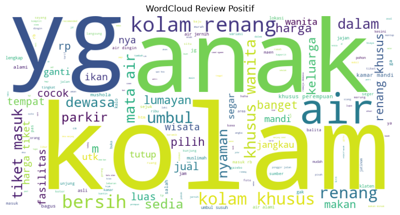
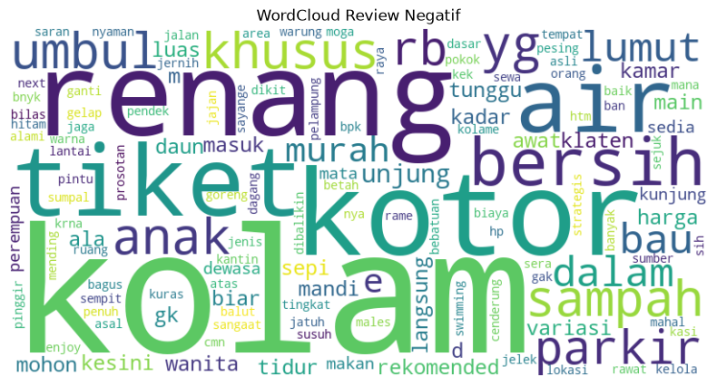

# 🏊 Sentiment Analysis — Umbul Susuhan Google Maps Reviews

Analisis sentimen terhadap ulasan Google Maps untuk **Umbul Susuhan**, sebuah wisata kolam renang mata air alami di Klaten, Jawa Tengah. Proyek ini menggunakan **Support Vector Machine (SVM)** dengan kernel linear untuk mengklasifikasikan ulasan pengunjung ke dalam sentimen **positif** atau **negatif**.

---

## 📖 Project Overview

Umbul Susuhan merupakan destinasi wisata air populer yang menawarkan kolam renang alami dari sumber mata air. Proyek ini bertujuan untuk:

1. **Mengumpulkan** ulasan pengunjung dari Google Maps (dataset lokal `data.csv` — 224 ulasan mentah).
2. **Membersihkan & memproses** teks ulasan menggunakan teknik NLP bahasa Indonesia.
3. **Membangun model klasifikasi** sentimen menggunakan SVM untuk membedakan ulasan positif dan negatif.
4. **Memvisualisasikan** distribusi sentimen dan kata-kata dominan melalui word cloud.

> Dataset bersumber dari scraping Google Maps reviews dan disimpan secara lokal dalam file `data.csv`.

---

## ✨ Features

| Feature | Detail |
|---|---|
| **Text Preprocessing** | Case folding, filtering (regex), tokenization, stopword removal (bahasa Indonesia), dan stemming menggunakan [Sastrawi](https://github.com/har07/PySastrawi) |
| **Feature Extraction** | TF-IDF Vectorization (`TfidfVectorizer` dari scikit-learn) |
| **Classification Model** | Support Vector Machine (SVM) dengan kernel linear dan `class_weight="balanced"` untuk menangani ketidakseimbangan kelas |
| **Evaluation** | Classification report (precision, recall, F1-score) dan 10-fold cross-validation |
| **Visualization** | Bar chart distribusi sentimen, Word Cloud untuk sentimen positif dan negatif |

---

## 📁 Project Structure

```
studi-kasus-sentimen-analisis-umbul-susuhan/
│
├── data.csv                 # Dataset mentah dari Google Maps (224 ulasan)
├── processed_data.csv       # Dataset bersih setelah preprocessing (100 ulasan)
│
├── olah_dataset.py          # Script preprocessing & pembersihan data
├── eda.py                   # Script Exploratory Data Analysis (bar chart)
├── modeling.py              # Script pemodelan SVM, evaluasi, & word cloud
│
├── wordcloud_positif.png    # Output word cloud sentimen positif
├── wordcloud_negatif.png    # Output word cloud sentimen negatif
│
├── requirements.txt         # Daftar dependensi Python
├── .gitignore
└── README.md
```

### Script Details

| Script | Deskripsi |
|---|---|
| **`olah_dataset.py`** | Membaca `data.csv`, melakukan labeling (⭐ ≥ 3.5 → positif, < 3.5 → negatif), lalu menerapkan pipeline preprocessing: *case folding → filtering → tokenization → stopword removal → stemming*. Hasil disimpan ke `processed_data.csv`. |
| **`eda.py`** | Membaca `processed_data.csv` dan menampilkan diagram batang (bar chart) distribusi kelas sentimen positif vs negatif. |
| **`modeling.py`** | Membaca `processed_data.csv`, melakukan TF-IDF vectorization, melatih model SVM (linear kernel, balanced class weight), mengevaluasi dengan classification report & 10-fold cross-validation, serta menghasilkan word cloud untuk kedua kelas sentimen. |

---

## 🚀 Installation & Setup

### Prerequisites

- Python 3.8+
- pip

### Step-by-step

1. **Clone repository**

   ```bash
   git clone https://github.com/<username>/studi-kasus-sentimen-analisis-umbul-susuhan.git
   cd studi-kasus-sentimen-analisis-umbul-susuhan
   ```

2. **Buat virtual environment** (opsional, disarankan)

   ```bash
   python -m venv .venv

   # Windows
   .venv\Scripts\activate

   # macOS / Linux
   source .venv/bin/activate
   ```

3. **Install dependensi**

   ```bash
   pip install -r requirements.txt
   ```

4. **Download NLTK data** (diperlukan untuk tokenization & stopwords)

   ```bash
   python -c "import nltk; nltk.download('punkt_tab'); nltk.download('stopwords')"
   ```

5. **Jalankan script secara berurutan**

   ```bash
   # Step 1: Preprocessing dataset
   python olah_dataset.py

   # Step 2: Exploratory Data Analysis (menampilkan bar chart)
   python eda.py

   # Step 3: Modeling, evaluasi, & word cloud
   python modeling.py
   ```

---

## 📊 Results

### Dataset Summary

| Metric | Nilai |
|---|---|
| Total ulasan mentah | 224 |
| Total ulasan setelah preprocessing | 100 |
| Ulasan positif | 92 |
| Ulasan negatif | 8 |
| Train-test split | 80:20 |

### Classification Report (SVM — Linear Kernel)

| Class | Precision | Recall | F1-Score | Support |
|---|:---:|:---:|:---:|:---:|
| **Negative** | 0.00 | 0.00 | 0.00 | 1 |
| **Positive** | 0.95 | 1.00 | 0.97 | 19 |
| **Accuracy** | — | — | **0.95** | 20 |
| **Macro Avg** | 0.47 | 0.50 | 0.49 | 20 |
| **Weighted Avg** | 0.90 | 0.95 | 0.93 | 20 |

### 10-Fold Cross-Validation

| Fold | 1 | 2 | 3 | 4 | 5 | 6 | 7 | 8 | 9 | 10 |
|---|:---:|:---:|:---:|:---:|:---:|:---:|:---:|:---:|:---:|:---:|
| **Accuracy** | 1.00 | 1.00 | 0.90 | 0.90 | 0.90 | 0.90 | 0.90 | 0.90 | 0.90 | 0.90 |

| Metric | Nilai |
|---|:---:|
| **Mean CV Accuracy** | **0.92** |

### Word Clouds

<p align="center">
  
  &nbsp;&nbsp;
  
</p>
<p align="center"><em>Kiri: Word Cloud Positif &nbsp;|&nbsp; Kanan: Word Cloud Negatif</em></p>

---

## 🛠️ Tech Stack

- **Python 3** — Bahasa pemrograman utama
- **Pandas & NumPy** — Manipulasi data
- **NLTK** — Tokenization & stopword removal
- **Sastrawi** — Stemming bahasa Indonesia
- **scikit-learn** — TF-IDF, SVM, evaluasi model
- **Matplotlib** — Visualisasi chart
- **WordCloud** — Visualisasi word cloud

---

## 📄 License

This project is for educational and research purposes.
